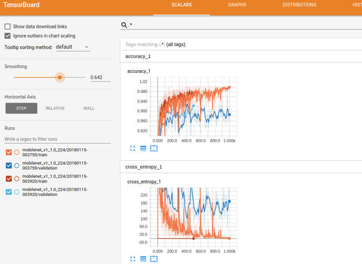

# Transfer Learning 101

## How do I get set up? ###

1. Make sure you either: 
    * create a virtual environment 
    * or are running a docker container with docker ([see here](https//hub.docker.com/r/tensorflow/tensorflow/))
2. Install the dependencies with the `requirements.txt` in this repo.

Both Python 2.7 and Python 3.5 should work (tested with 2.7 and 3.5). That said, it's time to let 2.7 go.


### TL;DR: Quick start with a virtual environment ###

```sh
$ virtualenv -p $(which python3) py-tf
$ source py-tf/bin/activate
$ pip install -r requirements.txt
```

### Pre-trained model & new dataset ###

1. Download the pre-trained model from [here](http://download.tensorflow.org/models/mobilenet_v1_1.0_224_2017_06_14.tar.gz), into tf_files/models.
2. Download the sample data ([flowers dataset](http://download.tensorflow.org/example_images/flower_photos.tgz)) to tf_files.
3. Extract it. Your folder structure should be:

```
tf_files/
   flower_photos/
     daisy/
        image97999.jpg
        ... 
     dandelion/
     ...
```


## Finding your way ###
`sh` is your entry point; there's a bash script to showcase the usage of the retraining code

`scripts` contains the retraining code; notice there have been some modifications to the original Tensorflow github script, 
but the interface is the same.

`tf_files` contains data, models and tensorboard logs (training_summaries), just
 like in the original Tensorflow Transfer Learning [tutorial](https://www.tensorflow.org/tutorials/image_retraining). However, you will be able to see
 stacked plots on the Tensorboard.


## Tensorboard ####
Notice tf_files/training_summaries contains the following structure:
   * architecture
      * training_timestamp
        * train
        * validation

This way you will be able to compare the loss function and other metrics from different trainings in the same Tensoboard
plot.



Once you've already launched a training, go to a second terminal and
start your Tensorboard with:

```sh
tensorboard --logdir=tf_files/training_summaries &
```

Go with your browser to http://localhost:6006 and enjoy!


## Plan for the workshop

**[Check the wiki!](https://github.com/ividal/TransferLearning/wiki)**

Recap:

We'll be switching back and forth between the command line (to launch trainings) to
Tensorboard (to see what's going on).

* Tweak parameters inside sh/retrain.sh and launch with
```
sh/retrain.sh
```
* Launch Tensoboard only once with 
```
tensorboard --logdir=tf_files/training_summaries
```


## License ###
Modifications are under the same Apache license as the original Tensorflow code.
